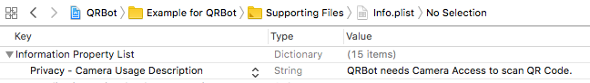

# QRBot

[](https://travis-ci.org/hardiiik/QRBot)
[](https://cocoapods.org/pods/QRBot)
[](https://cocoapods.org/pods/QRBot)
[](https://cocoapods.org/pods/QRBot)

## Requirements

`iOS 8+`

## Installation

QRBot is available through [CocoaPods](https://cocoapods.org). To install
it, simply add the following line to your Podfile:

```ruby
pod 'QRBot'
```

## Usage
Follow the steps to use QRBot:
1. You need to give permission to access Camera in `Info.plist`.



2. Make `QRCodeScannerViewController` superclass of your ViewController class.

```swift
 class ViewController: QRCodeScannerViewController {

    override func viewDidLoad() {
        super.viewDidLoad()
    }
 }
```

3. Conform/ Implement `QRCodeScannerDelegate` protocol and implement its method to perform your tasks.

```swift
 extension YourViewController: QRCodeScannerDelegate{
    func scanner(_ connection: AVCaptureConnection, didOutput data: String) {
        print("DemoApp : Data from QR Code - \(data)")
        // Perform your actions here with data from QRCode
    }
 }
```
4. Set `scannerDelegate` property of your ViewController to `self`.

```swift
 class ViewController: QRCodeScannerViewController {

    override func viewDidLoad() {
        super.viewDidLoad()
        scannerDelegate = self
    }
 }
```
5. All set. Now implement your tasks in delegate method.

## Example

Take a look at Example Project for more clarity. To run the example project, clone the repo, and run `pod install` from the Example directory first.

## Author

Hardik Trivedi, hardiktrivedi3008.ht@gmail.com

## License

QRBot is available under the MIT license. See the LICENSE file for more info.
